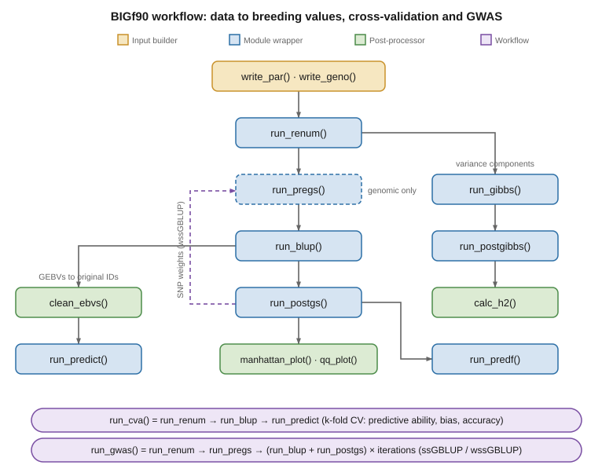

```{r, echo=FALSE}
knitr::opts_chunk$set(
  echo = TRUE,
  eval = FALSE,          # steps call the external BLUPf90 programs, so code is shown but not run
  message = FALSE,
  warning = FALSE,
  fig.align = "center",
  fig.width = 7,
  fig.height = 4.5
)
```

# Introduction

BIGf90 is an R package developed by [Breeding Insight](https://breedinginsight.org/)
that wraps the [BLUPf90 family of programs](http://nce.ads.uga.edu/wiki/doku.php)
for genetic evaluation. It lets you build the input files, run each module, and
post-process the results without leaving R. This tutorial walks through the full
pipeline, from raw data to breeding values, cross-validation and a single-step GWAS.

The same workflow runs with or without genotypes: drop the SNP file and you have a
pedigree BLUP; keep it and you have (weighted) single-step GBLUP. Every function
that calls a BLUPf90 program takes path_2_execs, the folder holding the
executables.

BIGf90 is organised in four layers &mdash; input builders, one wrapper per BLUPf90
module, R-side post-processors, and higher-level workflows that chain the modules:

| Category | BIGf90 function | BLUPf90 program | Purpose |
|:----------:|:-----------------:|:-----------------:|:---------:|
| **Input builders** | write_par()   | (R)            | Build the RENUMF90 parameter file from R              |
|                    | write_geno()  | (R)            | Build a BLUPf90 .geno file from a PLINK .ped       |
| **Module wrappers**| run_renum()   | renumf90     | Renumber IDs / effects, prepare renf90.*            |
|                    | run_gibbs()   | gibbsf90+    | Sample variance components (MCMC)                     |
|                    | run_postgibbs()| postgibbsf90| Posterior means / diagnostics from the Gibbs samples |
|                    | run_blup()    | blupf90+     | Solve (G)BLUP for breeding values                     |
|                    | run_predict() | predictf90   | Predictions / validation statistics                   |
|                    | run_pregs()   | preGSf90     | Genomic QC; build G / A22 / inverse                   |
|                    | run_postgs()  | postGSf90    | Back-solve SNP effects, window variances, weights     |
|                    | run_predf()   | predf90      | Direct genomic values for young genotyped animals     |
| **Post-processors**| calc_h2()     | (R)            | Heritability from the Gibbs output                    |
|                    | mcmc_diagnostics()| (R)        | CODA convergence diagnostics for the Gibbs chain      |
|                    | clean_ebvs()  | (R)            | Key the (G)EBVs back to original IDs                  |
|                    | manhattan_plot()| (R)          | GWAS Manhattan plot (variance explained or -log10 p)  |
|                    | qq_plot()     | (R)            | GWAS QQ plot + genomic inflation lambda               |
| **Workflows**      | run_cva()     | renumf90 + blupf90+ | K-fold cross-validation (ability, bias, accuracy) |
|                    | run_gwas()    | preGSf90 + blupf90+ + postGSf90 | ssGBLUP / wssGBLUP GWAS pipeline      |

Because these functions call the external BLUPf90 executables, the code below is
shown but not executed when the vignette is built &mdash; run it locally with the
programs installed.

# Workflow at a glance

The functions chain together as shown below. Build the inputs, renumber, then estimate
and post-process. The two workflow functions run whole paths end to end &mdash; run_cva()
for cross-validation, run_gwas() for the single-step GWAS &mdash; where the postGSf90 SNP
weights feed back into a weighted G for the wssGBLUP iterations (the purple loop).

```{r workflow, echo=FALSE, eval=TRUE, out.width="100%", fig.cap="BIGf90 pipeline. Boxes are coloured by layer (input builders, module wrappers, post-processors); dashed = genomic-only; the purple loop is the postGSf90 to preGSf90 SNP-weight feedback (wssGBLUP)."}

```

One-line pipeline: write_par() / write_geno() &rarr; run_renum() &rarr; (run_pregs(),
genomic only) &rarr; run_blup() **or** run_gibbs() &rarr; run_postgibbs() &rarr; calc_h2()
&rarr; run_postgs() / run_predf() / run_predict() / clean_ebvs() &rarr; manhattan_plot() /
qq_plot().

## Install

```{r}
install.packages("remotes")
remotes::install_github("Breeding-Insight/BIGf90", dependencies = TRUE)
library(BIGf90)
```

# What you need

* The BLUPf90 executables (renumf90, blupf90+, gibbsf90+, postgibbsf90,
  predictf90, preGSf90, postGSf90, predf90) in one folder &mdash; download
  from the [BLUPF90 wiki](http://nce.ads.uga.edu/wiki/doku.php).
* A phenotype file, a pedigree file, and (optionally) a genotype/SNP file plus a
  marker map for GWAS.

# Setup

```{r}
library(BIGf90)

path_2_execs <- "/path/to/blupf90/executables/"   # folder with the BLUPf90 programs
base_dir     <- "/path/to/your/analysis"          # your data + parameter files
setwd(base_dir)

animal_effect <- 3       # animal effect's NUMBER in the model (for calc_h2 / clean_ebvs / run_cva)
missing_code  <- -999    # missing-phenotype code
```

Two "animal" indices, easy to mix up: in write_par() below, random is the animal
effect's **column in the data file**; in calc_h2() / clean_ebvs() / run_cva(),
random_effect_col (or random_effect) is its **number in the model**. These are
usually different values.

# Prepare inputs

## Genotype file

For a genomic model you need a BLUPf90 genotype file: each line is the animal ID
followed by a contiguous string of one 0/1/2 dosage per SNP, with every row's
genotypes starting at the same column. Starting from PLINK, write_geno() builds
it directly from a .ped. By default it reads the --recode12 layout (two allele
codes per locus) and collapses each pair to a dosage (counting count_allele), so
1 1 &rarr; 0, 1 2 &rarr; 1, 2 2 &rarr; 2, and any 0 &rarr; the missing code
(default 5). Skip this step if you already have a .geno file or are running a
pedigree-only model.

```{r}
write_geno(
  ped  = "ped012.ped",     # PLINK --recode12 output (no header, 6 lead columns)
  file = "bf90_geno.txt",  # BLUPf90 genotype file to create
  map  = "ped012.map",     # optional: checks the marker count matches
  id_col = 2               # column with the animal ID (1 = FID, 2 = IID)
)
```

Set alleles_per_locus = 1 if the input already has one dosage per locus, and
map_out = "markers.snpmap" to also write a BLUPf90 marker map (needed for
1-Mb GWAS windows and Manhattan positions).

## Parameter file

renumf90 needs a parameter file describing the model. Build it from R (or write it
by hand). Omit snp_file and the genomic OPTIONs for a pedigree-only model.

```{r}
write_par(
  file     = "model.par",
  datafile = "phenotypes.txt",
  traits   = 4,                          # column of the trait in the data file
  residual_variance = 0.15,
  effects  = list(
    mean   = list(col = 2, type = "cross", class = "numer"),
    fixed1 = list(col = 3, type = "cross", class = "numer"),
    animal = list(col = 1, type = "cross", class = "alpha")   # the animal effect
  ),
  random        = 1,                     # animal effect's column in the data file
  random_type   = "animal",
  covariances   = 0.045,                 # additive variance starting value
  pedigree_file = "pedigree.ped",
  snp_file      = "bf90_geno.txt",       # omit for a pedigree-only model
  missing_value = missing_code,
  options = c("map_file markers.snpmap",           # for GWAS windows / Manhattan
              "callrate 0.9", "minfreq 0.05", "monomorphic 1"),
  overwrite = TRUE
)
```

# Renumber the model

run_renum() runs RENUMF90 in a fresh directory and writes the renumbered
renf90.par, renf90.dat, renadd0*.ped and the genomic side files. A small
helper keeps each analysis in its own folder and moves the optional inbreeding file.

```{r}
prep_renum <- function(par_file, out_dir) {
  dir.create(out_dir, recursive = TRUE, showWarnings = FALSE)
  run_renum(path_2_execs, raw_par_file = file.path(base_dir, par_file),
            output_files_dir = out_dir, verbose = FALSE)
  inb <- file.path(base_dir, "renf90.inb")
  if (file.exists(inb)) file.rename(inb, file.path(out_dir, "renf90.inb"))
  normalizePath(out_dir)
}

out <- prep_renum("model.par", file.path(base_dir, "renumbered"))
```

# Variance components

Sample the variance components with gibbsf90+, summarise with postgibbsf90, then
turn them into a heritability with calc_h2().

```{r}
run_gibbs(path_2_execs, input_files_dir = out, output_files_dir = out,
          gibbs_iter = 100000, gibbs_burn = 20000, gibbs_keep = 10, verbose = FALSE)
run_postgibbs(path_2_execs, input_files_dir = out, output_files_dir = out,
              postgibbs_burn = 1, postgibbs_keep = 1, verbose = FALSE)

h <- calc_h2(random_effect = animal_effect, input_files_dir = out)
h$h2
```

calc_h2() reads postgibbsf90's posterior means (postmean) by default. If
postgibbsf90's diagnostic step fails on a chain (it can, leaving postmean
empty), set from_postmean = FALSE to compute the posterior-mean heritability
straight from the gibbs_samples file instead, which also returns its posterior
standard deviation.

```{r}
h <- calc_h2(random_effect = animal_effect, input_files_dir = out,
             from_postmean = FALSE)          # read the Gibbs samples directly
c(h2 = h$h2, sd = h$h2_sd)
```

## Convergence diagnostics

Before trusting the variance components, check that the Gibbs chain mixed and
converged. mcmc_diagnostics() wraps the CODA package: it reads the samples (from
gibbs_samples by default, which survives even when postgibbsf90's diagnostic step
fails), builds a coda mcmc object of the (co)variance components plus heritability,
and reports autocorrelation, effective sample size, and the Geweke, Raftery-Lewis
and Heidelberger-Welch diagnostics &mdash; writing a multi-page PDF (trace/density,
autocorrelation, Geweke, normal-QQ) alongside a text summary.

```{r}
d <- mcmc_diagnostics(input_files_dir = out, random_effect = animal_effect)
d$effective_size     # per-parameter effective sample size
d$geweke             # Geweke z-scores (|z| > ~2 suspect)
```

Rough reading: Geweke |z| within about 2 and a Raftery-Lewis dependence factor below
5 indicate the chain converged and mixed well; a low effective sample size relative
to the stored samples flags strong autocorrelation (increase the thinning interval or
the chain length). Needs the coda package (install.packages("coda")).

# Breeding values

run_blup() and clean_ebvs() operate on the current directory, so move into the
renumbered folder first.

```{r}
setwd(out)                 # run_blup / clean_ebvs work on the current folder
run_blup(path_2_execs)
clean_ebvs(random_effect_col = animal_effect,
           solutions_output_name = "ebvs_clean.txt")
setwd(base_dir)
```

ebvs_clean.txt holds the (G)EBVs keyed back to the original animal IDs. To predict
new records or produce validation statistics from a fitted model, run_predict()
wraps predictf90 in the same directory.

# Cross-validation

run_cva() runs K-fold cross-validation and writes a results table. For a genomic
model it builds G once and reuses it across folds.

```{r}
set.seed(101919)   # repeatable folds
run_cva(path_2_execs      = path_2_execs,
        missing_value_code = missing_code,
        random_effect_col  = animal_effect,
        h2                 = h$h2,
        num_runs           = 10,       # independent CV replicates
        num_folds          = 5,        # folds per replicate
        input_files_dir    = out,
        output_files_dir   = out,
        output_table_name  = "cv_results.txt",
        genotyped_only     = FALSE,    # see below
        verbose            = FALSE)
```

cv_results.txt reports, using the phenotype corrected for fixed effects (y\*):
**predictive ability** = cor(y\*, ebv^), **bias** = the slope of the regression of
y\* on ebv^ (1 = unbiased), and **accuracy** = predictive ability / sqrt(h2).

For genomic runs, genotyped_only controls the reference set:

* FALSE (default) &mdash; matches the complete-data design: all phenotyped
  animals train, folds are drawn only from genotyped+phenotyped animals (those are
  what gets tested), and G is built on all genotyped animals.
* TRUE &mdash; restricts the whole analysis to the genotype-and-phenotype
  intersection: phenotyped-only records are dropped from training and
  genotyped-only animals are removed from the genotype file.

run_cva() reports how many records are genotyped (used for testing) versus
phenotyped-only or genotyped-only (not used), so you can see exactly what entered
the analysis.

# Single-step GWAS

run_gwas() chains the genomic modules into a weighted single-step GBLUP GWAS:
run_renum() &rarr; run_pregs() (genomic QC) &rarr; iterated run_blup() +
run_postgs(), re-estimating the SNP weights each iteration. iterations = 1 is
plain ssGBLUP (equal weights); iterations = 2 reproduces the second-iteration
weights used by Vallejo et al. (2024). Pass the raw parameter file (the one you fed
to write_par(), with a snp_file and a map_file).

```{r}
g <- run_gwas(path_2_execs,
              raw_par_file     = file.path(base_dir, "model.par"),
              output_files_dir = file.path(base_dir, "gwas_run"),
              iterations  = 2,      # 1 = ssGBLUP, 2 = wssGBLUP (2nd iteration)
              windows_mbp = 1,      # 1-Mb sliding windows (needs map_file)
              verbose     = TRUE)

head(g$snp_sol)          # per-SNP: trait, effect, snp, chr, pos, snp_effect, weight, ...
```

## Manhattan plot

manhattan_plot() draws straight from the outputs. The default y axis is the
proportion of additive genetic variance explained &mdash; per non-overlapping window
(by = "window", the wssGBLUP standard) or per SNP (by = "snp"). Use
chromosomes = to drop unmapped or rank-coded chromosomes, highlight = to flag
windows above a variance cutoff, and save_to = to write a PNG/PDF.

```{r}
manhattan_plot(g, by = "window", highlight = 0.02,
               main = "1-Mb window variance explained",
               save_to = file.path(g$run_dir, "manhattan_windows.png"))
```

Because variance explained is not a test statistic, the reference threshold here is
a numeric variance cutoff (e.g. threshold = 0.02 for 2%), not a p-value correction.

## p-values, QQ plot and genomic inflation

For classic p-value GWAS, add OPTION snp_p_value by setting snp_pvalue = TRUE in
run_gwas(). This is heavier (memory and time), so it is usually run as a single
ssGBLUP pass. It fills the var_a_hat column of snp_sol, from which the per-SNP
test statistic (a^2 / var(a), distributed chi-square with 1 df; Aguilar et al. 2019)
and its p-value are computed.

```{r}
gp <- run_gwas(path_2_execs,
               raw_par_file     = file.path(base_dir, "model.par"),
               output_files_dir = file.path(base_dir, "gwas_pval"),
               iterations = 1, windows_mbp = 1, snp_pvalue = TRUE)
```

qq_plot() shows whether the p-values are well calibrated and reports the genomic
inflation factor lambda = median(observed chi-square) / 0.4549 (the null median of a
chi-square with 1 df). Lambda near 1 is well calibrated; > 1 indicates inflation
(structure, relatedness, artifacts); < 1 indicates deflation, which is common in
single-step models because the relationship matrix already absorbs structure. Draw
one panel per chromosome with per_chromosome = TRUE.

```{r}
qq_plot(gp, save_to = file.path(gp$run_dir, "qq_overall.png"))         # overall QQ + lambda
qq_plot(gp, per_chromosome = TRUE)                                     # one panel per chromosome
```

On the p-value Manhattan, threshold accepts multiple-testing lines: "bonferroni"
(-log10(alpha / m)), "fdr" (Benjamini-Hochberg at level alpha, less conservative
under LD), and "meff" (Bonferroni on a supplied effective number of tests meff).

```{r}
manhattan_plot(gp, statistic = "pvalue",
               threshold = c("bonferroni", "fdr"), alpha = 0.05,
               main = "Exact single-step GWAS p-values",
               save_to = file.path(gp$run_dir, "manhattan_pvalue.png"))
```

If (and only if) the QQ plot shows genuine inflation, gc_correct = TRUE applies a
single-parameter genomic-control correction (divides every statistic by lambda before
recomputing p) in both qq_plot() and the p-value manhattan_plot(). In single-step
analyses lambda is often below 1, so correction is usually unnecessary.

# Genomic building blocks

run_gwas() orchestrates the genomic modules, but you can call them directly. After a
genomic run_renum(), run_pregs() runs preGSf90 (genotype QC; builds G, A22 and
the inverse), run_postgs() runs postGSf90 (back-solves SNP effects, window
variances and SNP weights) after a genomic run_blup(), and run_predf() runs
predf90 to get direct genomic values for young genotyped animals from the SNP
effects.

```{r}
run_pregs(path_2_execs, input_files_dir = out)                 # QC + G / A22 / inverse
setwd(out); run_blup(path_2_execs); setwd(base_dir)            # genomic BLUP
run_postgs(path_2_execs, input_files_dir = out)                # SNP effects + weights
run_predf(path_2_execs, snp_file = "young_animals.geno",       # DGV for new genotypes
          input_files_dir = out, acc = TRUE)
```

# Genomic vs pedigree-only

Run the pipeline twice into separate folders to compare:

* **Genomic:** keep snp_file (and map_file for GWAS) in the .par.
* **Pedigree-only:** drop snp_file and the genomic OPTIONs.

Then compare cv_results.txt / ebvs_clean.txt between the two to quantify what the
genotypes add.

# Session information

```{r, eval=TRUE}
sessionInfo()
```

# How to cite

If you use BIGf90 in research, run citation("BIGf90") for the current reference,
and cite the BLUPf90 programs (Misztal et al. 2014).

```{r, eval=TRUE}
citation("BIGf90")
```

# Acknowledgments

Developed as part of the [Breeding Insight](https://www.breedinginsight.org)
initiative to provide open-source, data-driven tools for modern breeding programs.
